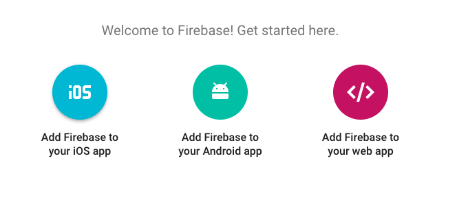

# FreQs
#### _Epicodus Angular Javascript Independent Project: Angular CLI, Dynamic Routing, and Persistent Data with Firebase, August 25, 2017_
_**By Michelle Poterek**_


## Description
This project is meant to be used for individuals in the noise community in Portland as an alternative to Facebook events. Users are able to register as a musician, event attendee, or an organizer. Users are able to browse users by this criteria as well in the event that they are looking for a fellow user to contact.

## Installation instructions
* Open Terminal and type:
* `$ cd Desktop`
* `$ git clone https://github.com/PoterekM/FreQs.git`
* `$ cd FreQs`
* `$ npm install`
* `$ bower install`
* `$ atom .`
* for firebase:
* First off, you'll need to make a free account at Firebase's website. [Firebase](https://www.learnhowtoprogram.com/javascript/angular-extended/firebase-introduction-and-setup)
* Create a New Project. Select this option, provide a name for your new project, and select your Country/region from the drop-down menu.
* Select Add Firebase to your web app.

* make src/app/api-keys.ts
* paste the code below into your api-keys.ts file.

````
export var masterFirebaseConfig = {
    apiKey: "xxxx",
    authDomain: "xxxx.firebaseapp.com",
    databaseURL: "https://xxxx.firebaseio.com",
    storageBucket: "xxxx.appspot.com",
    messagingSenderId: "xxxx"
  };

````
* With the information provided in the modal, replace the "xxxx" variables with your own firebase credentials in your api-keys.ts file.
* Be sure to save these changes in atom.
* In Terminal, run `$ ng serve`
* In your Browser (Chrome preferred) navigate to [http://localhost:4200/](http://localhost:4200/)


## User Story
* As a user, I'd like to visit a page to see a list of all team or club members.
* As a user, I'd like to click a team or club member's entry in the list to visit their profile page, which should include more details about them.
* As a user, I'd like the option to visit an "About" page that explains what the club is, and what they do.
* As a user, I'd like all data persisted in a database, so it's always there when I need it.
* As an administrator, I want to add new users to the club. (User authentication is not required).
* As an administrator, I want to edit user profiles, in case I make a mistake, or need to update their details.
* As an administrator, need the option to delete a user, in case they leave the club or team.

## Planning
1. Configuration/dependencies
  * Generate new project using `ng new FreQs`
  * Initialize Bower
  * Add Boostrap to project
  * Create a firebase project and add configuration to project

2. Specs
  * Specs are as listed above in the User Story

3. Integration
  * Initial routes or index pages with all dependencies in Controller/index.html head
  * Template/html page for viewing all members.
    * New users will also be added on this page with full CRUD functionality.
  * Template for about page.
  * Template/html page for events.
    * This will include dynamic routing to view an individual event.
      * Hosted by:
      * Cost:
      * Location:
      * Event Description
      * Ability to add Photo
    * This will also include a pipe to filter by type of event.
  <!-- * Template/html page for ... (one for each route/integrated user story)
  * Display...
  * Integrate feature that... -->

4. UX/UI
  * Include and modify bootstrap/materialize/Sass etc.
  * Develop custom style

5. Polish
  * Refactor minor portion of...
  * Delete unused...
  * Make README awesome

6. Wishlist
  * Have ability to show events in organized time line.
  * Deploy to firebase.
  * Be able to show past events hosted by a user.
  * Have the ability for a user to be checked as having attended an event.
  * Have the ability for a user to view their past events.

<!-- ## Screenshot of Program

_This image is a screenshot of an individual posting_ -->

## Technologies Used
* Angular CLI
* NodeJS
* Bower
* TypeScript
* Firebase
* Bootstrap, CSS, and HTML

## Known Bugs
* The design for the selection of user priority is flawed- these will be changed to checkboxes in the near future.
* The admin route is not functional. Any user is able to edit or delete another user.

## Support and contact details
Please feel free to contact me directly via e-mail at poterekm@gmail.com if you have any questions, comments, ideas, or feedback. Also, I invite you to feel empowered to make any changes to this repository by forking it and making changes accordingly.

## License Information
This web application is free to use under the MIT License &copy; Michelle Poterek

----
## Additional Information for Developers
## Development server

Run `ng serve` for a dev server. Navigate to `http://localhost:4200/`. The app will automatically reload if you change any of the source files.

## Code scaffolding

Run `ng generate component component-name` to generate a new component. You can also use `ng generate directive/pipe/service/class/module`.

## Build

Run `ng build` to build the project. The build artifacts will be stored in the `dist/` directory. Use the `-prod` flag for a production build.

## Running unit tests

Run `ng test` to execute the unit tests via [Karma](https://karma-runner.github.io).

## Running end-to-end tests

Run `ng e2e` to execute the end-to-end tests via [Protractor](http://www.protractortest.org/).
Before running the tests make sure you are serving the app via `ng serve`.

## Further help

To get more help on the Angular CLI use `ng help` or go check out the [Angular CLI README](https://github.com/angular/angular-cli/blob/master/README.md).
